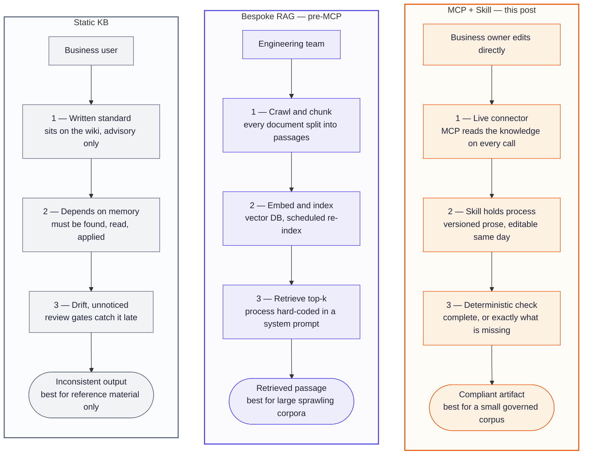
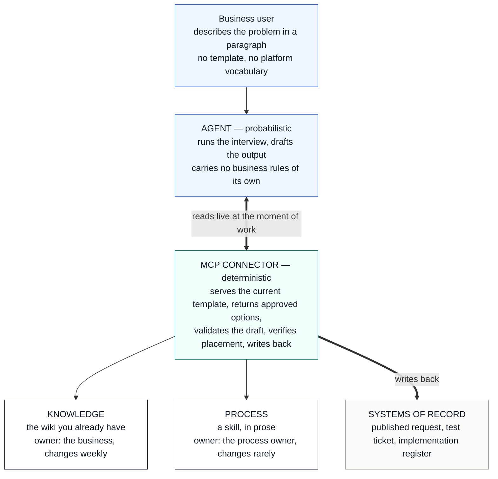
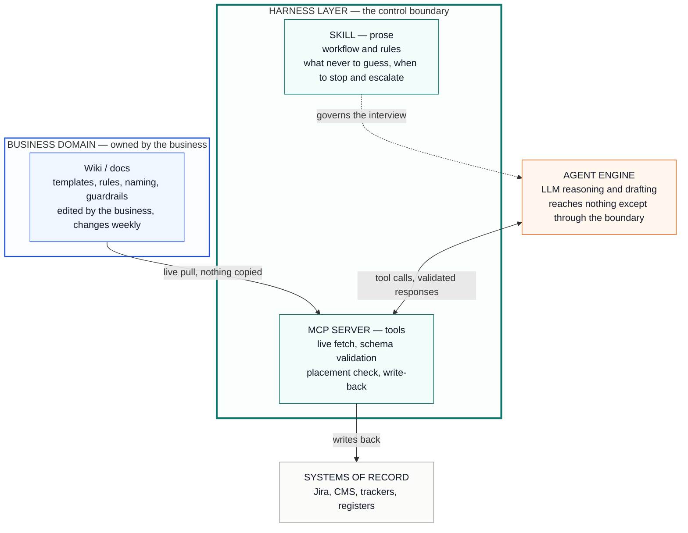

# Internal Knowledge as a Service

## TL;DR

- **A written standard can't enforce itself.** Compliance depends on someone remembering it exists, finding the current version, and choosing to apply it.
- **An agent changes that, because it reads.** Consulted at the moment of work, on every request, the standard stops being a reference and becomes a control point.
- **That needs an operating model, not more context.** The **knowledge** stays on the wiki the business owns; a **connector** reads it live and checks the finished work against it; a written **skill** holds the process.
- **The payoff:** rules change by editing a page — no developer, no release — and an incomplete request comes back as a list of what's missing, not a document with a hole in it.
- **The limits:** a small, curated knowledge base; it only sees the systems it's connected to; and it amplifies your standard rather than fixing it.

## A knowledge base can't enforce anything

Every organization has its standards written down. Almost none of them get followed consistently, and that isn't a discipline problem.

A document can only ever suggest. It can't announce that it exists. It can't tell you it changed last week. It can't stop a specification being written that ignores it, and it can't distinguish between someone who read it and someone who didn't. Compliance depends on a person remembering the knowledge exists, finding the current version, and choosing to apply it — three chances to fail before any work starts.

So we compensate afterwards. Review gates. Checklists. Templates copied once and then quietly diverging. A platform team catching problems late enough that fixing them is expensive.

The knowledge itself is rarely the gap. It's in the templates people copy, the naming conventions nobody can quite recite, the decision records, the runbooks, the segmentation rules, the one paragraph in a wiki that turns out to be the real contract everyone works to. It exists. It has simply never been in the room at the moment the work happens.

## What's missing isn't context. It's an operating model for it

When an agent does the drafting, something changes — not because the model is clever, but because it reads. A standard consulted at the moment of work, on every request, without depending on anyone's memory or goodwill, is a different kind of object from a standard sitting on a wiki. It stops being a reference and becomes a control point — and that is available to any process whose standard is already written down.

What it takes is a controlled way to put proprietary knowledge in front of an agent, evidence that the agent actually used it, and an arrangement plain enough that security and platform owners will put their name to it.

Internal knowledge as a service, in other words: published rather than copied, owned by someone, versioned, and reachable in its current form at the moment it matters.

## Three ways to close the gap

*Same goal, three approaches — what changed isn't the ambition, it's who ends up owning the copy of the knowledge.*

There are only really three, and the difference between them isn't ambition. It's who ends up owning the copy of the knowledge.

**The static knowledge base** is column one — where most organizations are today, and where this piece started. The standard sits on the wiki, advisory only, and everything downstream depends on someone remembering it exists. Fine for reference material. Not fine for anything that needs enforcing.

**The bespoke pipeline** is what closing that gap used to require, before MCP existed. Crawl the space, chunk every document into passages, embed them, store them in a vector database, schedule a re-index, retrieve top-k at query time, and hard-code the process into a system prompt. Then hand-write the integrations and build a front end, because there was no host application to plug into. Months of engineering, a team, and infrastructure to run indefinitely.

Effort isn't the difference that matters, though. **That system owns a copy of the knowledge**, and everything follows from it: drift between source and index, re-index lag, and chunking that destroys the structure you depend on — a table row holding a pick-list does not survive being cut into passages. What comes back is a retrieved passage, not the current standard. The control plane sits with engineering too, so changing a question means a commit, a review and a deploy.

None of which makes that approach wrong. It is the right answer to a different question — a large, sprawling corpus where you cannot know in advance which document matters, and a team with the budget and headcount to run it.

**The connector and the skill** is column three, and it is what the rest of this describes.

## How this one actually works

*The knowledge base sits outside the harness. The connector and the skill are what wrap the model.*

Same system, drawn as a control boundary rather than a flow — because the first thing an architect asks is *what sits inside the trusted layer, and what doesn't*.

The model sits outside that boundary and reaches nothing except through it. Everything it is allowed to know about how we work crosses the line in one direction, and everything it produces crosses back in the other — checked on the way. The model reasons but never holds a standard. The connector fetches and validates but holds no rules of its own. The skill decides the shape of the conversation. Move any one of those three across the line and the guarantees change.

Three layers, each with one job and one owner.

**The knowledge stays where it is** — on the wiki the business already maintains. Nothing is copied, nothing is indexed. It could be Confluence, SharePoint, a docs repo. What matters is that someone owns it.

**A connector reads it live, and checks the result against it.** An MCP server, holding no rules of its own: it fetches whatever the standard says today, offers only the answers that standard allows, then checks the finished draft against the same source. The model runs the interview; the connector decides whether the result passes. Compliance isn't something an agent can talk its way into.

**A skill holds the process** — what to ask, what must never be guessed, when to stop and escalate.

Keeping those last two apart is the point. Knowledge changes weekly and belongs to the business; process changes rarely and belongs to whoever runs it. Split that way, each is updated by the person who owns it.

What that buys:

- **Rules change without a release.** We needed a new mandatory field, answered from a fixed list. I added one row to a table in the knowledge base. On the next run the agent asked the new question, in the business's own wording, and flagged the earlier submissions that were now incomplete. No code, no deployment, no ticket.
- **Nothing goes stale.** There's no second copy to drift, so the standard being applied is always the one currently published.
- **Failure is visible.** An incomplete request comes back as a list of what's missing, not a confident document with a hole in it.
- **The requester needs to know nothing.** They describe what they need in plain language, answer a few questions offering options rather than a blank form, and the finished artifact lands where it belongs — complete, checked, and recorded.

## Why it holds up

A model on its own answers once and stops. Wrapped in the connector, the skill and the live knowledge, it becomes a **harness** — the control layer deciding what to call, in what order, and whether what comes back is trustworthy enough to hand to a person. And the reason that beats a well-crafted prompt is the loop, not the prompt. It thinks, calls a tool, observes what came back, and thinks again, until the request is complete or there is a specific reason to escalate. A chatbot answers. A harness keeps working until the standard is satisfied — and every loop still passes the same deterministic check, so more reasoning doesn't buy a way around it.

Two objections land straight away. **If editing the knowledge changes what the system does, who controls it?** The same permissions and version history that already govern the standard, owned by the business rather than an IT backlog. **And if the wiki is unreachable?** Reads are cached, and when the standard can't be read the agent stops rather than guesses. The failure mode is refusal, not confident improvisation.

## Where it runs out — and the layer you add next

This works because the knowledge base is small and well kept — dozens of governed items, not thousands. Grow it well past that and exact fetch stops being enough on its own.

The instinct is to read that as a trade-off: direct fetch *or* search. It isn't. They answer different questions, and a mature setup runs both.

**Layer 1 — direct fetch.** For anything with a shape: templates, forms, pick-lists, schemas, approved option lists, the current version of a named rule. No chunking, no embedding, no relevance scoring. You ask for a specific thing and get that thing, whole and current. This is where determinism lives, and it is the only layer a compliance check can be built on.

**Layer 2 — search, called as a tool.** For anything without a shape: historical cases, prior decisions, sprawling documentation, *has anyone dealt with this before*. The agent reaches for it when it needs context rather than a rule — and it doesn't matter that retrieval is approximate, because nothing is being validated against the result.

The part that matters is that **the connector orchestrates both**. Search becomes another tool call behind the same boundary, subject to the same checks, rather than a second architecture bolted alongside the first. Adding Layer 2 doesn't undo Layer 1 — it stops Layer 1 being asked to do a job it was never suited for.

I have only built Layer 1. Layer 2 is where this goes when the corpus outgrows it, and I would rather say that plainly than describe a system larger than the one actually running.

Two things it doesn't do. It only sees the systems it's connected to, so it will never tell you that no conflict exists — it tells you what it checked and what it couldn't. And it applies your standard rather than inventing one: a contradictory standard produces bad work faster.

## The agent was never the point

None of this is clever. A wiki, a connector, a written process, and a harness holding them together so a model can keep working instead of answering once. The interesting part was realizing the knowledge was always the asset, and the agent only ever the thing reading it.

Treat internal knowledge as a service and the agent becomes the least interesting part of the system. That was the surprise.
